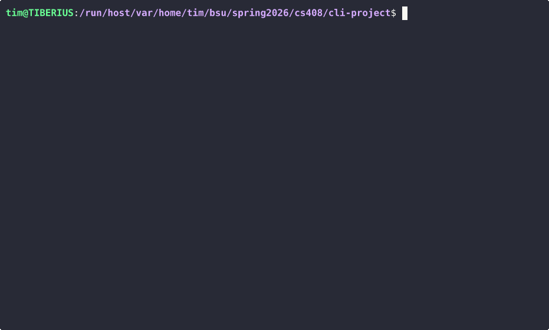

# Canvas Module Progress CLI

A command-line tool written in Go that connects to the Canvas LMS REST API and displays module completion progress for your courses. Useful for quickly checking which modules you've completed without opening a browser.

## Demo



## Setup Instructions

### Prerequisites

- [Go 1.21+](https://go.dev/dl/)
- A Canvas API token (see steps below)

### 1. Clone the repo

```bash
git clone https://github.com/timLP79/cs408-mini-lab.git
cd cs408-mini-lab
```

### 2. Install dependencies

```bash
go mod download
```

### 3. Create your `.env` file

Copy the example file and fill in your credentials:

```bash
cp .env.example .env
```

Open `.env` and replace the placeholder values:

```
CANVAS_API_TOKEN=your_token_here
CANVAS_BASE_URL=https://boisestatecanvas.instructure.com
```

**How to get your Canvas API token:**
1. Log in to Canvas and click your profile picture in the left sidebar
2. Click **Settings**
3. Scroll to **Approved Integrations** and click **+ New Access Token**
4. Set a purpose (e.g. "CS408 CLI") and an expiry date, then click **Generate Token**
5. Copy the token immediately — Canvas will only show it once

### 4. Run the tool

```bash
go run .
```

## Example Usage

### List your courses

```bash
go run .
```

Expected output:
```
Your Courses:
-------------------------------
1: COEN Undergrad Students
2: Department of Computer Science - Students Groups
3: Fa24 - CS 153 - Navigating Computer Systems
4: Sp26 - CS 408 - Full Stack Web Development
5: Sp26 - CS 410/510 - Databases
6: Sp26 - MATH 301 - Introduction to Linear Algebra

Enter course number:
```

### View module progress for a course

```
Enter course number: 4

Sp26 - CS 408 - Full Stack Web Development
------------------------------
[✓] Course Resources
[~] Week 1 - Introduction and Overview       [███████----] 7/11
[~] Week 2 - CS208 Database Review           [█---] 1/4
[~] Week 3 - Tech Stack                      [█---] 1/4
[~] Week 4 - Form Teams                      [██-] 2/3
[✓] Week 5 - Developer Setup
[~] Week 6 - AWS                             [██-] 2/3
[ ] Week 7 - Project Specification           [-] 1/2
[ ] Week 8                                   [--] 0/2
[ ] Week 16 - Final Project Showcase         [---] 0/3
```

Column width adjusts dynamically to the longest module name in the selected course. Progress bars scale to the number of trackable items in each module — each character represents one item.

**Module status legend:**
- `[✓]` green — completed (with a tracked completion timestamp)
- `[~]` yellow — in progress
- `[ ]` white — unlocked but not started, or no trackable items
- `[🔒]` red — locked

## API Endpoints Used

| Endpoint | Method | Description |
|----------|--------|-------------|
| `/api/v1/courses` | GET | Retrieves all courses the authenticated user is enrolled in |
| `/api/v1/courses/:id/modules` | GET | Retrieves all modules and their completion state for a given course |
| `/api/v1/courses/:id/modules/:id/items` | GET | Retrieves individual items within a module and their completion status |

All endpoints handle pagination by following the `Link` response header until all pages are retrieved.

## Reflection

> To be written upon project completion.
